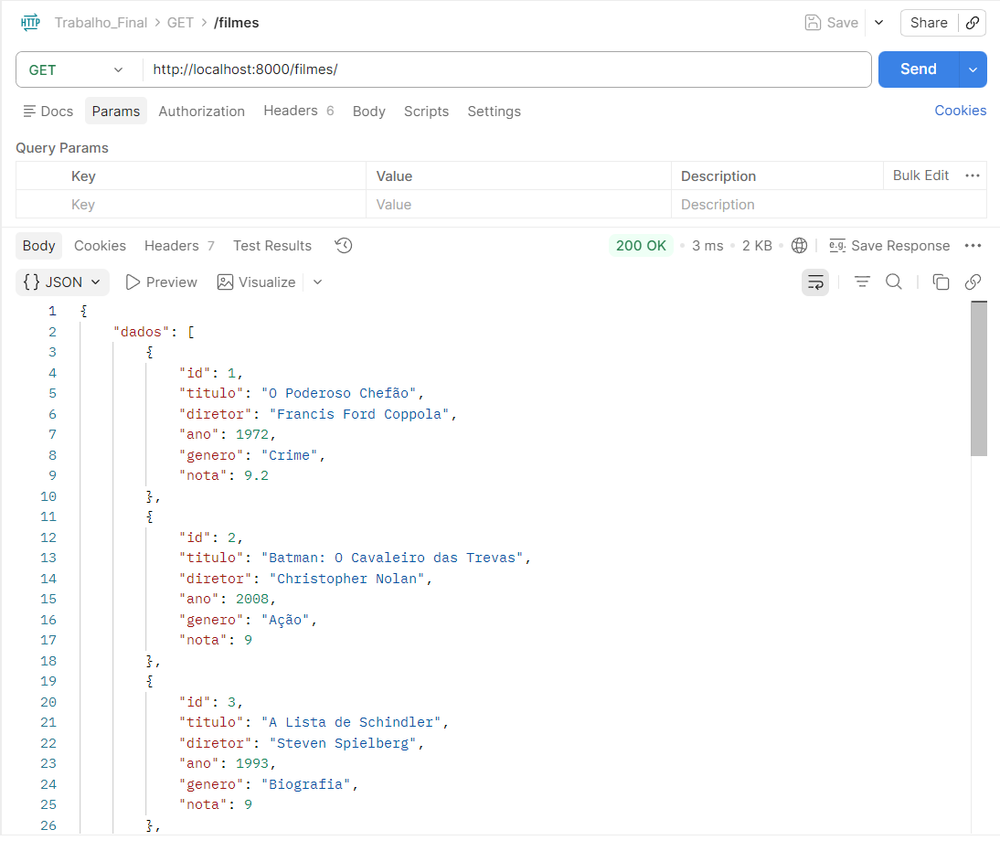
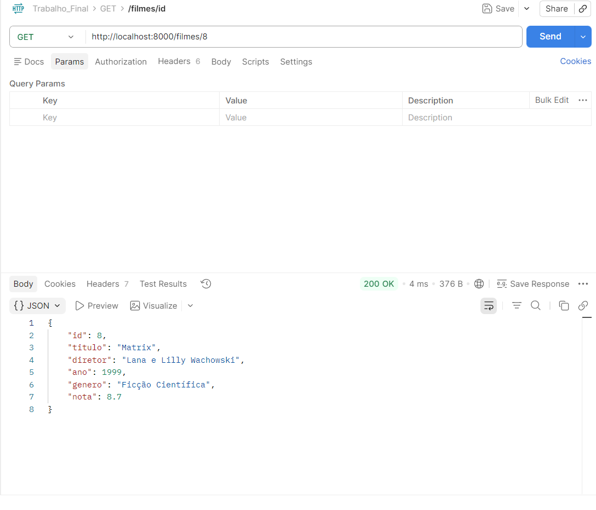
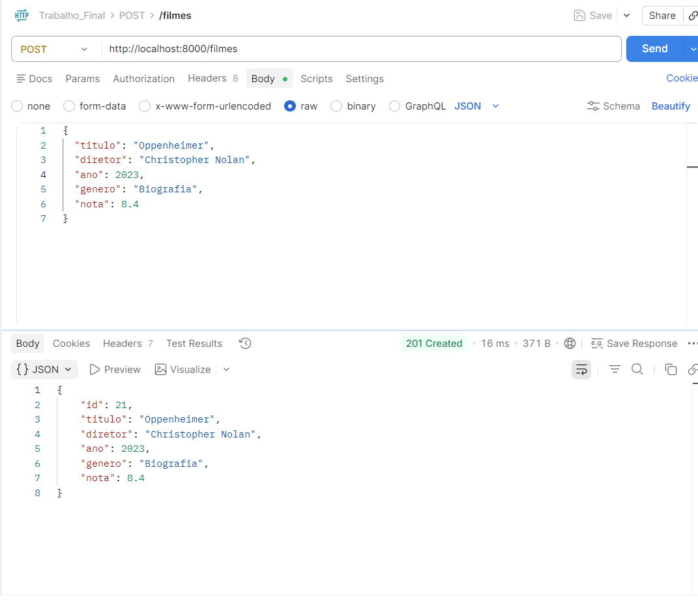
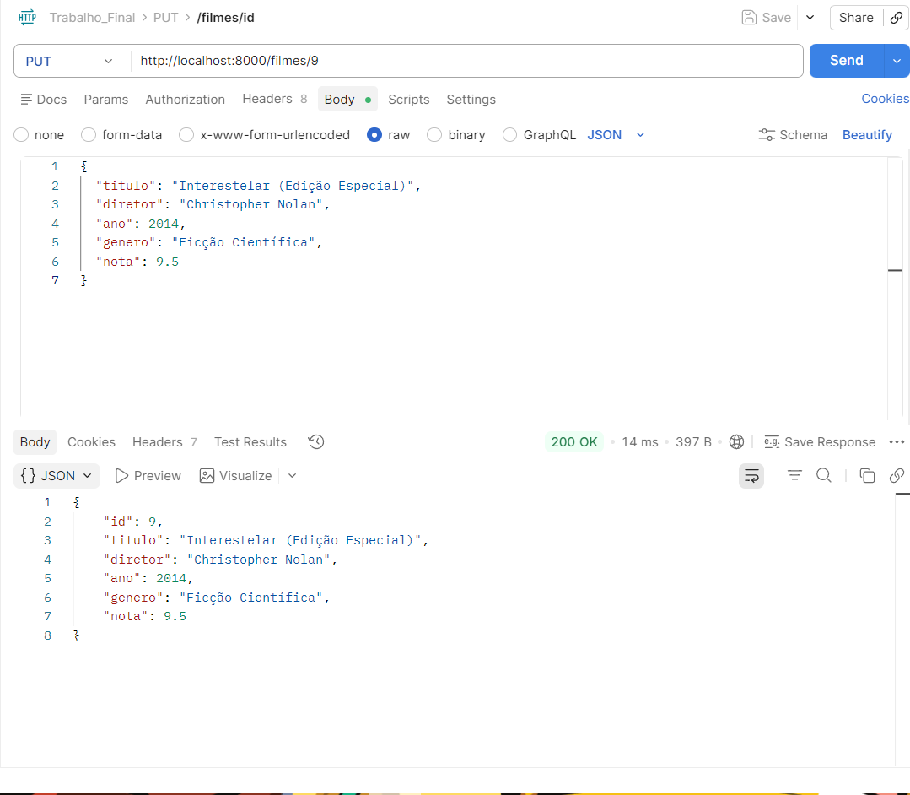
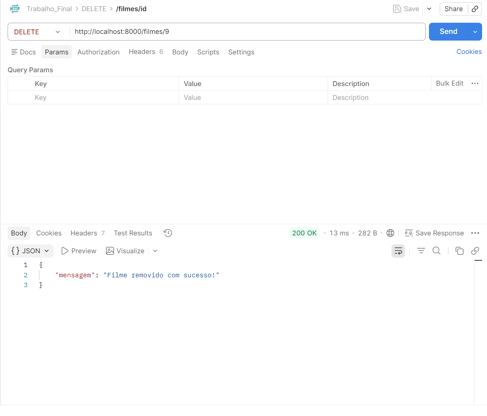
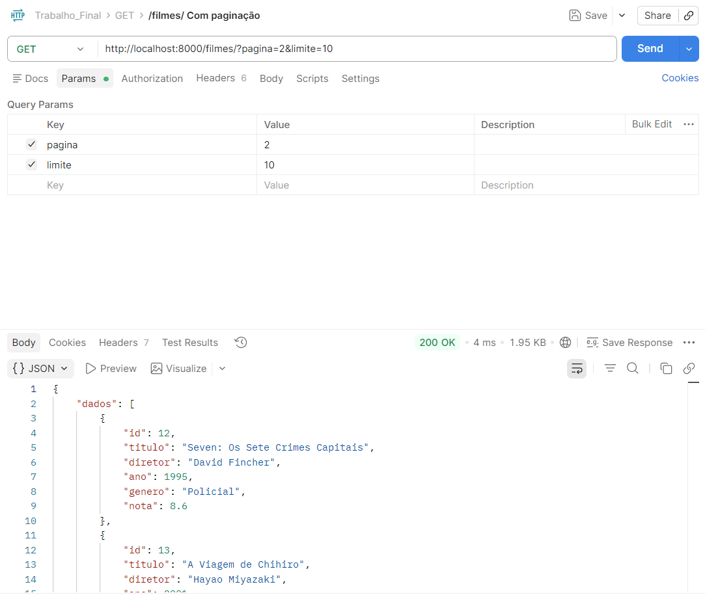
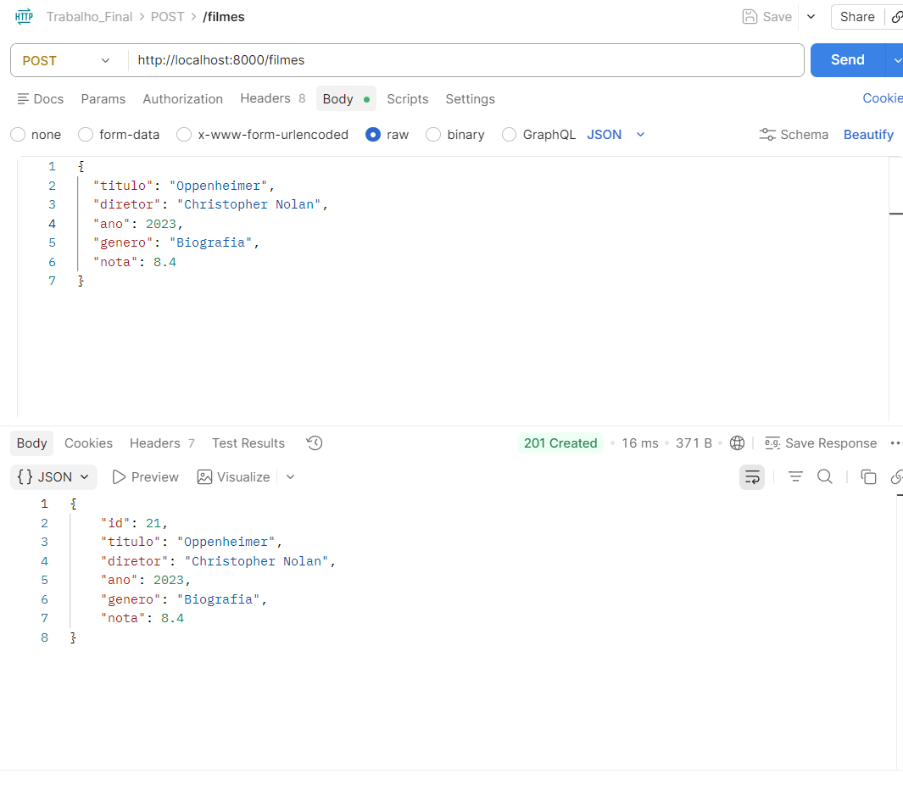

# Trabalho API - Catálogo de Filmes (SQLite Edition)

## Sobre o Projeto

Esta é uma API REST para gerenciamento de um catálogo de filmes, desenvolvida em Node.js com Express e persistência de dados real utilizando SQLite.

## Tecnologias Utilizadas

 - **Node.js:** Ambiente de execução.
 - **Express:** Framework para as rotas.
 - **SQLite3:** Banco de dados relacional.

 ## Como Instalar e Rodar

 **1 - Clonar o projeto ou baixar a pasta.** 

 **2 - Instalar as dependências:** No terminal, dentro da pasta do projeto, rode:
 
 ```
 Bash

 npm install
 ```

**3 - Iniciar o servidor:** 

```
Bash

npm run dev
```

**4 - O banco de dados será criado automaticamente e populado com 20 registros iniciais.**

## Lista de Endpoints:

## GET

**Rota -** `/filmes`

**Descrição -** Lista filmes com paginação e filtros

**Parâmetros -** pagina, limite, genero, ordem

**Print do Postman:**



**Rota -** `/filmes/:id` 

**Descrição -** Busca um filme específico por ID

**Parâmetros -** N/A

**Print do Postman:**



## POST

**Rota -** `/filmes` 

**Descrição -** Cadastra um novo filme 

**Body(JSON) -** `titulo`, `diretor`, `ano`, `genero`, `nota`



## PUT

**Rota -** `/filmes/:id`

**Descrição -** Atualiza um filme existente

**Body(JSON) -** `titulo`, `ano`, `diretor`, `genero`, `nota`

**Print do Postman:**



## DELETE

**Rota -** `/filmes/:id`

**Descrição -** Remove um filme do banco pelo ID

**Observação -** Ação irreversível

**Print do Postman:**



## Exemplos de Requisição (Postman)

### Listagem com Paginação (Página 2)

- **URL:** `http://localhost:8000/filmes?pagina=2&limite=10`

- **Método:** `GET`

- **Print do Postman:**



### Cadastro de Filme (POST)

- **URL:** `http://localhost:8000/filmes`
- **Body:**

```
JSON

{
  "titulo": "Oppenheimer",
  "diretor": "Christopher Nolan",
  "ano": 2023,
  "genero": "Biografia",
  "nota": 8.4
}
```

**Print do Postman:**




## Validações Implementadas

**1 - Campos Obrigatórios:** Impede o cadastro se algum campo estiver faltando.

**2 - Tipagem Estrita:** Verifica se `ano` e `nota` são números.

**3 - Persistência Real:** Os dados não são perdidos ao reiniciar o servidor.

**4 - Filtro por Gênero:** Permite buscar apenas categorias específicas (ex: `?genero=Crime`).

**5 - Ordenação:** Suporte para ordem crescente e decrescente (`?ordem=desc`).